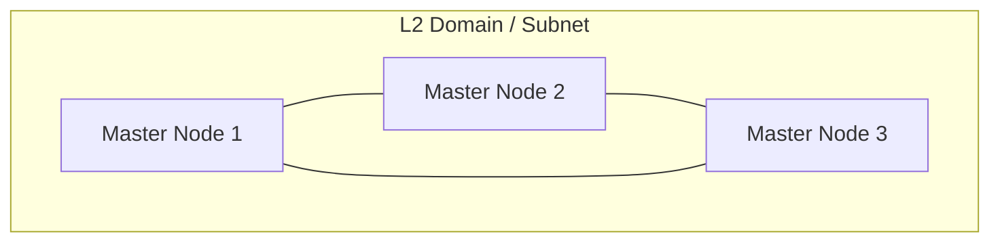
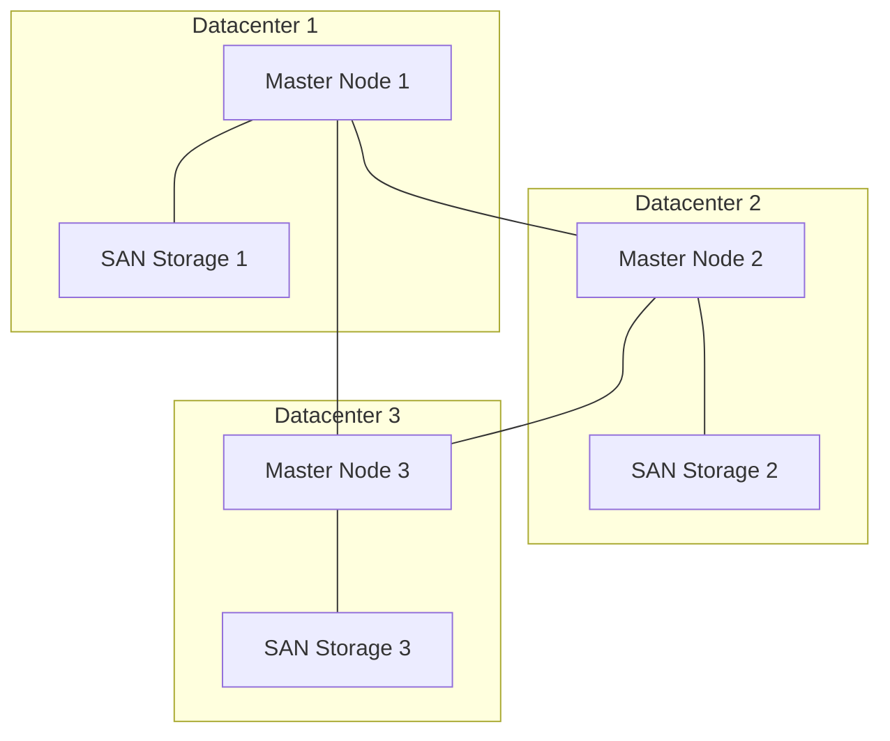
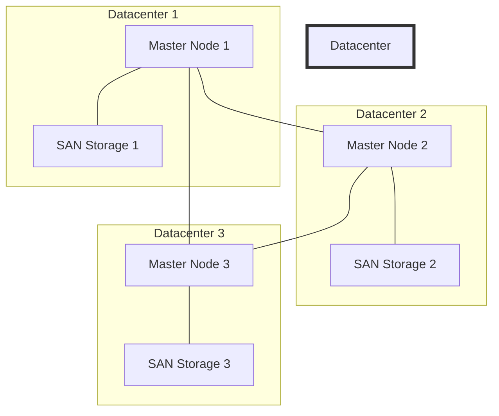
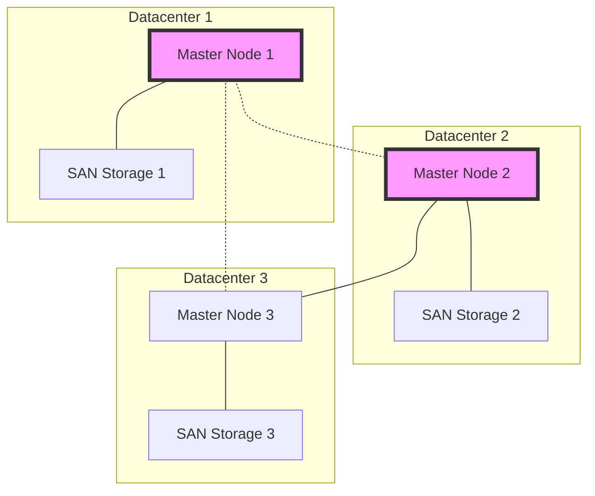
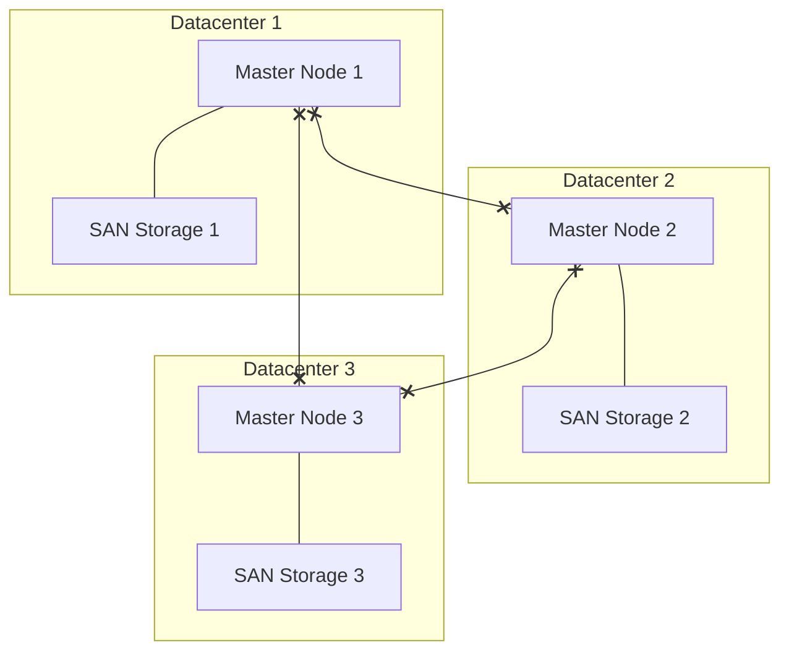

# OpenShift Geo-Redundancy: Container-Native Approaches and Legacy Considerations

## Introduction

In today's distributed computing landscape, ensuring high availability and disaster recovery capabilities is crucial. This guide explores two approaches to implementing geo-redundancy with Red Hat OpenShift, an enterprise Kubernetes platform: application-level geo-redundancy and stretched datacenters. While we'll cover both, it's important to note that for container-native applications, application-level geo-redundancy is generally the preferred and recommended approach.

## Application-Level Geo-Redundancy: The Container-Native Approach

### Overview

Application-level geo-redundancy is an approach where the responsibility for geographical distribution and redundancy is built into the applications themselves, rather than relying on infrastructure-level solutions. This approach aligns well with the principles of container-native development and the capabilities of container orchestration platforms like OpenShift.

### Key Characteristics

1. **Independent Clusters**: Each geographical location runs its own independent OpenShift cluster.
2. **Application Design**: Applications are designed to be aware of and handle distribution across multiple locations.
3. **Data Synchronization**: Data consistency across locations is managed at the application level, often using eventual consistency models.
4. **Load Balancing**: Global load balancing directs traffic to the appropriate cluster based on factors like proximity or cluster health.

### Benefits

1. **Scalability**: Easier to scale as each cluster can be managed independently.
2. **Performance**: Reduced latency as each cluster operates locally.
3. **Resilience**: Failures in one location do not directly impact others.
4. **Flexibility**: Allows for location-specific configurations and easier updates.

### Considerations

1. **Application Complexity**: Requires applications to be designed with distribution in mind.
2. **Data Management**: Need for robust data synchronization strategies.
3. **Operational Overhead**: Managing multiple independent clusters.

## Stretched Datacenter Approach: Legacy Considerations

While not recommended for most container-native applications, understanding the stretched datacenter approach is valuable, especially when dealing with legacy systems or specific use cases that require it.

### OpenShift Control Plane in Stretched Datacenters

#### Control Plane Architecture

In a stretched datacenter configuration, the OpenShift control plane, typically consisting of three master nodes, is distributed across different physical locations while maintaining a single Layer 2 (L2) domain and subnet.

#### Why Three Master Nodes?

1. **High Availability**: Continues to function even if one node fails.
2. **Quorum Maintenance**: Ensures a majority for decision-making.
3. **Load Distribution**: Improves performance and responsiveness.

#### Vulnerable Components

1. **etcd**: Distributed key-value store for cluster data.
2. **API Server**: Front-end for the Kubernetes control plane.
3. **Controller Manager**: Manages cluster state controllers.
4. **Scheduler**: Assigns workloads to worker nodes.

### Storage Layer in Stretched Datacenters

In this configuration, each datacenter typically has its own SAN (Storage Area Network) storage.

#### Impact on Control Plane Implementation

1. **Data Locality**: Local storage access reduces latency.
2. **Storage Redundancy**: Separate SANs provide inherent redundancy.
3. **Consistency Challenges**: Maintaining data consistency across distributed storage is complex.
4. **Latency Considerations**: Cross-datacenter storage operations may introduce latency.
5. **Storage Network Design**: Requires careful design for efficient replication.
6. **Capacity Planning**: Each SAN must handle potential failover scenarios.

## Failure Scenarios in Stretched Datacenter Environments

Understanding potential failure scenarios is crucial for maintaining a resilient OpenShift environment in a stretched datacenter configuration. While these scenarios primarily apply to the legacy stretched datacenter approach, they illustrate the complexities and risks that container-native, application-level geo-redundancy aims to mitigate. Let's examine three key scenarios and their impacts on both the control plane and storage layer.

### Scenario 1: Single Datacenter Failure

In this scenario, we'll examine the impact of a complete failure of one datacenter in a three-datacenter stretched configuration.

**Impact**:
- Loss of one-third of the control plane capacity
- Potential loss of running workloads in the failed datacenter
- Increased load on remaining datacenters
- Loss of access to the failed datacenter's SAN storage
- Potential data unavailability for workloads that were using non-replicated storage in the failed datacenter

**Recovery**:
- The cluster continues to operate with two remaining master nodes
- Workloads can be rescheduled to the surviving datacenters
- No immediate action required for control plane, but restoration of the failed datacenter should be prioritized
- Ensure that critical control plane data is replicated and accessible from the surviving datacenters
- Rebuild any lost data from backups or replicas on the remaining SANs

### Scenario 2: Network Partition

In this scenario, network connectivity between datacenters is lost, creating a split-brain situation.

**Impact**:
- Potential split-brain scenario where isolated nodes may continue to operate independently
- Disruption in cluster-wide operations and potential data inconsistencies
- Applications may experience connectivity issues or unexpected behavior
- Potential split-brain scenario for storage, where each partition may continue writing to its local SAN
- Risk of data divergence between SANs in different partitions

**Recovery**:
- Automated leader election may occur, potentially causing service disruptions
- Manual intervention may be required to restore network connectivity
- Once connectivity is restored, the cluster will need to reconcile any conflicting states
- After restoring network connectivity, a careful reconciliation of storage data may be necessary
- Implement automated tools or procedures to detect and resolve data inconsistencies across SANs

### Scenario 3: Stretched VLAN Failure

In this scenario, the stretched VLAN that connects all three datacenters fails, isolating the control plane nodes.

**Impact**:
- Complete loss of communication between control plane nodes
- Cluster-wide operations cease to function
- Applications may continue to run but cannot be managed or scaled
- While local storage remains accessible, cross-datacenter storage operations fail
- Replication between SANs is interrupted, potentially leading to data inconsistencies

**Recovery**:
- Immediate restoration of the VLAN is critical
- Once connectivity is restored, the control plane should automatically re-establish itself
- Manual intervention may be required to reconcile cluster state and workload distribution
- Once VLAN connectivity is restored, initiate a full sync of storage data across all three SANs
- Verify the integrity and consistency of control plane data stored across the distributed storage system

## Mitigation Through Container-Native Approaches

The failure scenarios described above highlight the complexities and risks associated with stretched datacenter configurations. Container-native, application-level geo-redundancy approaches aim to mitigate these risks by:

1. **Eliminating Single Points of Failure**: By distributing applications across independent clusters, the failure of a single datacenter or network link has a reduced impact on overall system availability.

2. **Simplifying Recovery**: With each cluster operating independently, recovery from failures is often simpler and more localized.

3. **Improving Data Consistency**: By managing data replication at the application level, container-native approaches can implement more flexible and robust consistency models.

4. **Enhancing Scalability**: Independent clusters can be scaled or updated without affecting the entire system, reducing the risk of global outages.

5. **Reducing Complexity**: By eliminating the need for stretched L2 networks and complex storage replication, container-native approaches reduce the overall system complexity.

## Comparison and Recommendations

### Application-Level Geo-Redundancy (Recommended for Container-Native Applications)

- **Pros:**
  - Aligns with container-native principles
  - Provides application-specific redundancy strategies
  - Reduces dependency on complex infrastructure
  - Better performance and scalability
- **Cons:**
  - Requires careful application design
  - May increase initial development complexity

### Stretched Datacenter Approach (Legacy Consideration)

- **Pros:**
  - Provides a unified cluster view
  - Simplifies management for legacy applications
  - Enables automatic failover at the infrastructure level
- **Cons:**
  - Increases infrastructure complexity
  - Requires low-latency, high-bandwidth connections
  - May introduce performance issues
  - Challenges in maintaining data consistency

### Strong Recommendation

For container-native applications with OpenShift/Kubernetes, the choice should clearly be application-level geo-redundancy. This approach:

1. Aligns better with container-native principles and microservices architectures.
2. Provides greater flexibility and scalability.
3. Reduces reliance on complex, potentially fragile infrastructure configurations.
4. Enables more efficient use of resources across different geographical locations.
5. Allows for easier updates and maintenance of individual components.

### When to Consider Stretched Datacenters

While not recommended for most container-native applications, stretched datacenters might be considered in specific scenarios:

1. When dealing with legacy applications that cannot be easily refactored.
2. In highly regulated environments with strict data locality requirements.
3. For specific use cases that absolutely require a single, unified cluster view.

## Conclusion

In the era of container-native applications and containerization, application-level geo-redundancy is the clear choice for implementing resilient, scalable OpenShift environments across multiple locations. This approach leverages the inherent capabilities of containerized applications and Kubernetes, allowing for more flexible, performant, and maintainable solutions.

While stretched datacenter configurations may still have a place in certain legacy or specialized scenarios, organizations should strive to move towards application-level geo-redundancy when possible. This shift not only aligns with container-native best practices but also positions applications to better take advantage of cloud-native features and distributed architectures.

As you plan your OpenShift deployment strategy, prioritize application-level geo-redundancy. Invest in designing your applications to be location-aware and capable of managing their own distribution. This approach will yield more robust, scalable, and future-proof solutions in the long run.

Remember, the goal is to create highly available, geographically distributed Kubernetes environments that meet the demands of container-native applications while aligning with evolving best practices in cloud-native development and operations.
